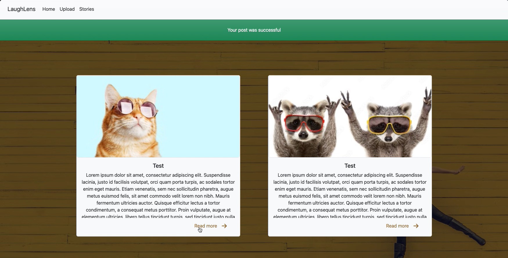

# LaughLens App

Welcome to the "LaughLens" app! This project is a part of "The Ultimate 2023 Fullstack Web Development Bootcamp." LaughLens is a web application that allows users to share funny stories and images with a global community. It's not just a project; it's a part of my journey to becoming a full-stack web developer.

## Technologies Used

LaughLens is built with the following technologies:

- **Django:** A high-level Python web framework for rapid development.

- **HTML, CSS, and Bootstrap:** For creating the frontend interface and user experience.

- **Image Upload:** Utilizing Django's ImageField for handling image uploads.

